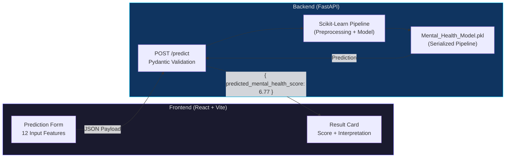
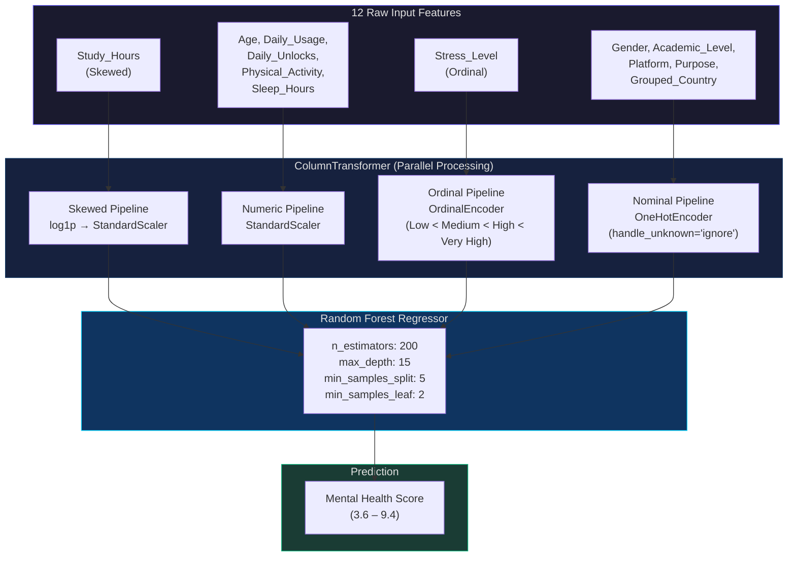
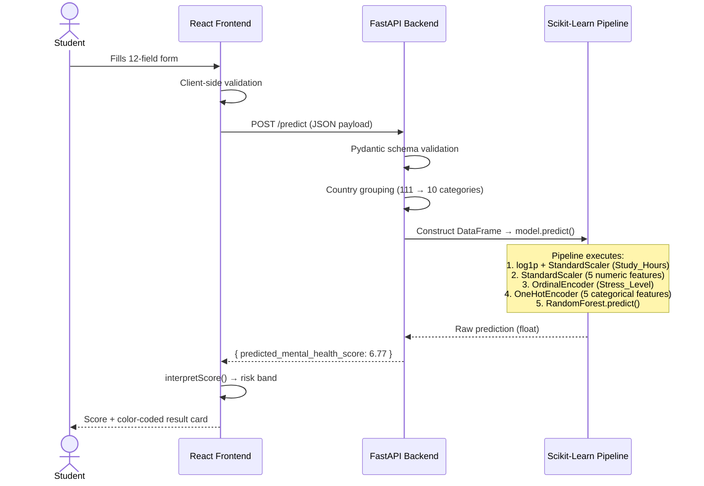
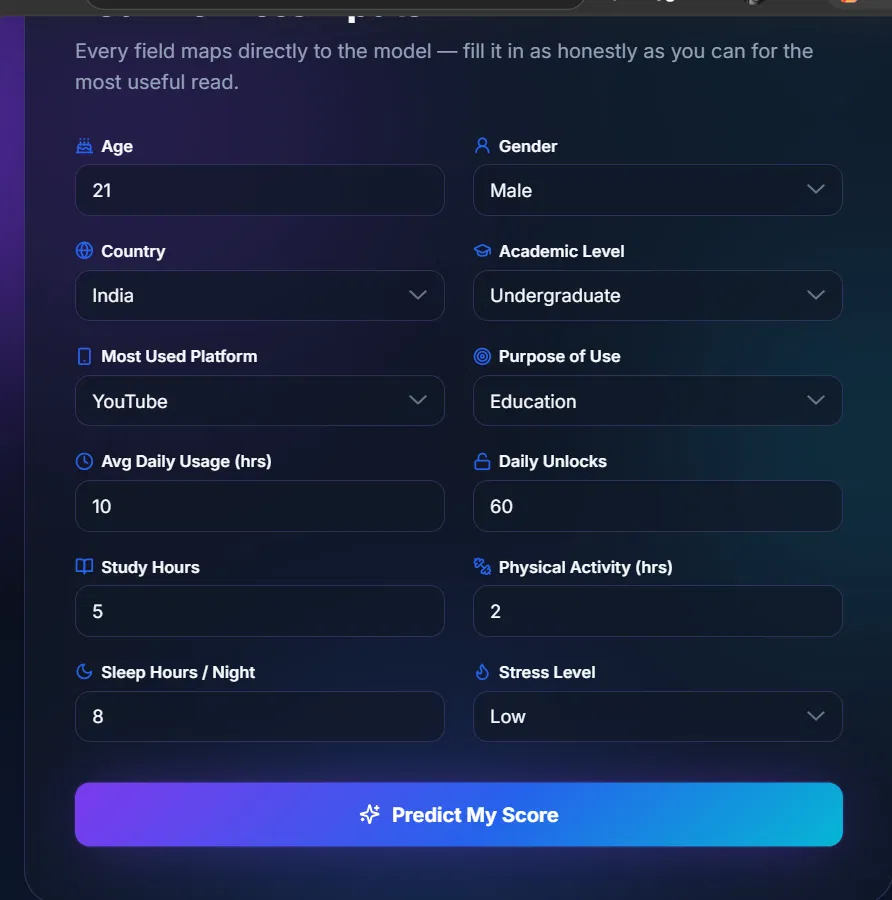
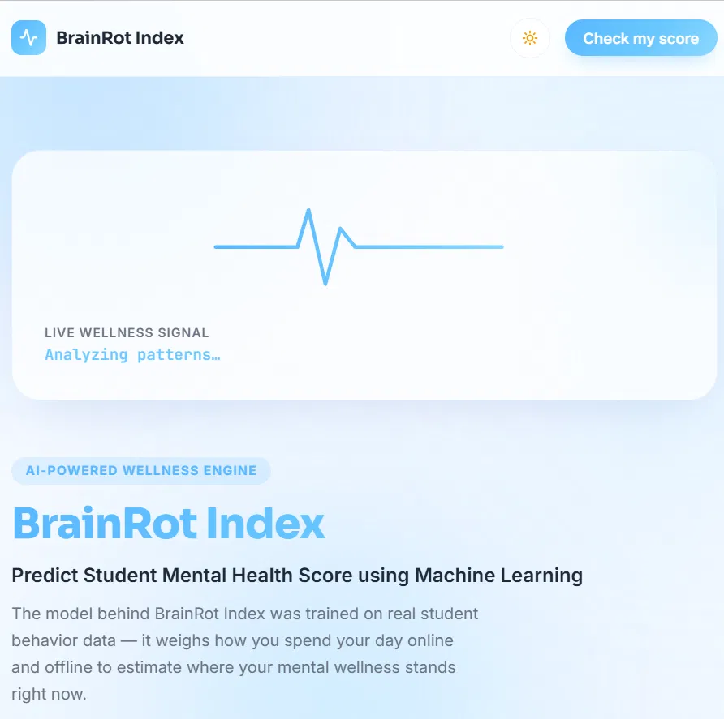

<p align="center">
  
</p>

<h1 align="center">🧠 BrainRot Index</h1>

<p align="center">
  <strong>Predict Student Mental Health Score using Machine Learning</strong>
</p>

<p align="center">
  <a href="https://brainrot-index-frontend-9eit.onrender.com"></a>
  <a href="https://github.com/atharv-0705/BrainRot-Index"></a>
  <a href="https://www.linkedin.com/in/atharv-gupta-45a37b36a/"></a>
</p>

<p align="center">
  
  
  
  
  
  
</p>

<p align="center">
  <a href="https://brainrot-index-frontend-9eit.onrender.com">
    
  </a>
</p>

---

## 📌 Problem Statement

In today's hyper-connected world, students spend significant portions of their day on social media platforms. While social media enables learning, networking, and entertainment, excessive and unbalanced usage patterns can quietly erode **mental well-being** — affecting sleep, increasing stress, and reducing productive activities like studying and physical exercise.

**The problem:** There is no accessible, data-driven tool that takes a student's daily behavioral patterns — social media usage, sleep hours, study time, physical activity, stress levels — and provides an objective, quantifiable estimate of their mental wellness.

**BrainRot Index** solves this by training a **Random Forest Regression model** on real student behavioral survey data to predict a **Mental Health Score** (continuous scale: 0–10). The model captures complex, non-linear interactions between lifestyle features that traditional linear approaches miss, achieving a **Test R² of 0.88** — meaning it explains 88% of the variance in student mental health outcomes.

---

## 🎯 Objectives

- **Build a predictive ML model** that maps student behavioral data (social media habits, sleep, study hours, stress, physical activity) to a mental health score
- **Deploy a production-grade REST API** using FastAPI for real-time inference
- **Create an accessible web interface** allowing students to self-assess their mental wellness
- **Demonstrate end-to-end ML engineering**: data cleaning → EDA → feature engineering → model selection → hyperparameter tuning → deployment

---

## ✨ Features

| Feature | Description |
|---|---|
| 🤖 **ML-Powered Prediction** | Random Forest model trained on 5,000+ student records with R² = 0.88 |
| ⚡ **Real-Time Inference** | FastAPI backend returns predictions in milliseconds |
| 🎨 **Modern UI** | Dark/Light mode, animated backgrounds, responsive design |
| 📊 **Score Interpretation** | Automatic classification into risk bands (High Risk → Healthy) |
| 🔍 **Input Validation** | Pydantic-based server-side validation with user-friendly error messages |
| 🌍 **Country-Aware** | Handles 111+ countries via intelligent grouping strategy |

---

## 🏗️ System Architecture



---

## 🔬 ML Pipeline Architecture



---

## 🖥️ Frontend Overview

The frontend is a **React 18 SPA** built with **Vite**, featuring:

- **Dark/Light Theme Toggle** — persisted in localStorage, synced via React Context
- **Animated Aurora Background** — CSS-based ambient animation
- **Pulse Wave Hero** — SVG heartbeat animation on the landing section
- **Prediction Form** — 12 controlled input fields mapping directly to the ML model features
- **Result Card** — Displays predicted score with color-coded interpretation bands and progress bar
- **Error Handling** — Distinguishes network, validation, and server errors

> _The frontend serves as a clean interface to the ML backend — the core intelligence lives in the model pipeline._

---

## 🛠️ Tech Stack

| Layer | Technology |
|---|---|
| **Machine Learning** | Python, Scikit-Learn, Pandas, NumPy, SciPy |
| **Model Pipeline** | ColumnTransformer, StandardScaler, OrdinalEncoder, OneHotEncoder, RandomForestRegressor |
| **Backend API** | FastAPI, Pydantic, Uvicorn, Joblib |
| **Frontend** | React 18, Vite 5, Lucide Icons, Vanilla CSS |
| **Deployment** | Render (Backend + Frontend as separate services) |
| **Notebook** | Jupyter Notebook (EDA, Training, Evaluation) |

---

## 📁 Folder Structure

```
BrainRot-Index/
├── 📓 Mental_Health_Score_Predictor.ipynb   # EDA, feature engineering, model training
├── 📊 Student Social Media And Mental Health Impact.csv  # Raw dataset (5,001 rows × 13 cols)
├── 🤖 Mental_Health_Model.pkl               # Serialized scikit-learn pipeline (~25 MB)
├── ⚡ main.py                               # FastAPI backend with /predict endpoint
├── 📋 requirements.txt                      # Python dependencies
├── 🖼️ assets/                               # README assets (banner, screenshots)
│
└── 🎨 frontend/                             # React + Vite frontend
    ├── index.html                           # Entry point with theme preload script
    ├── package.json                         # Node dependencies
    ├── vite.config.js                       # Vite configuration
    └── src/
        ├── App.jsx                          # Root component (state machine: idle→loading→success/error)
        ├── main.jsx                         # React DOM mount
        ├── index.css                        # Global styles + CSS custom properties
        ├── config.js                        # API URLs and app metadata
        ├── context/
        │   └── ThemeContext.jsx             # Dark/Light theme provider
        ├── data/
        │   └── formOptions.js              # Dropdown options matching Pydantic schema
        ├── utils/
        │   ├── api.js                      # Fetch wrapper with typed error handling
        │   └── scoreUtils.js               # Score → risk band interpretation
        └── components/
            ├── AuroraBackground/           # Animated CSS background
            ├── Header/                     # Navigation + theme toggle
            ├── Hero/                       # Landing section + PulseWave SVG
            ├── PredictionForm/             # 12-field input form + FormField
            ├── ResultCard/                 # Score display + progress bar
            ├── LoadingState/               # Spinner during API call
            ├── ErrorAlert/                 # Categorized error messages
            ├── ThemeToggle/                # Light/Dark switch
            └── Footer/                     # Site footer
```

---

## ⚙️ Backend Setup

### Prerequisites
- Python 3.10+
- pip

### Installation

```bash
# Clone the repository
git clone https://github.com/atharv-0705/BrainRot-Index.git
cd BrainRot-Index

# Create and activate virtual environment
python -m venv .venv
# Windows
.venv\Scripts\activate
# macOS/Linux
source .venv/bin/activate

# Install dependencies
pip install -r requirements.txt

# Run the FastAPI server
uvicorn main:app --reload --port 8000
```

The API will be live at `http://localhost:8000`. Visit `http://localhost:8000/docs` for the interactive Swagger UI.

### API Endpoint

```http
POST /predict
Content-Type: application/json

{
  "age": 21,
  "gender": "Male",
  "country": "India",
  "academic_level": "Undergraduate",
  "most_used_platform": "YouTube",
  "purpose_of_use": "Education",
  "avg_daily_usage_hours": 10,
  "daily_unlocks": 60,
  "study_hours": 5,
  "physical_activity_hours": 2,
  "sleep_hours_per_night": 8,
  "stress_level": "Low"
}
```

**Response:**
```json
{
  "predicted_mental_health_score": 6.77
}
```

---

## 🎨 Frontend Setup

```bash
cd frontend

# Install dependencies
npm install

# Start development server
npm run dev
```

The frontend will open at `http://localhost:5173`. Update `src/config.js` to point to your local backend if needed.

---

## 📊 Dataset Description

| Property | Detail |
|---|---|
| **Source** | Student Social Media and Mental Health Impact Survey |
| **Records** | 5,001 rows (5,000 after duplicate removal) |
| **Features** | 12 predictors + 1 target |
| **Missing Values** | 0 (clean dataset) |
| **Duplicates** | 2 removed |

### Feature Dictionary

| # | Feature | Type | Range / Categories | Description |
|---|---|---|---|---|
| 1 | `Age` | Numeric | 18 – 24 | Student age |
| 2 | `Gender` | Categorical | Male, Female | Gender identity |
| 3 | `Country` | Categorical | 111 unique → grouped to 10 | Country of residence |
| 4 | `Academic_Level` | Categorical | High School, Undergraduate, Graduate | Education level |
| 5 | `Most_Used_Platform` | Categorical | 12 platforms (YouTube, Instagram, TikTok, …) | Primary social media platform |
| 6 | `Purpose_Of_Use` | Categorical | Networking, Education, Entertainment, News | Why they use social media |
| 7 | `Avg_Daily_Usage_Hours` | Numeric | 1.0 – 8.8 hrs (μ = 5.08) | Daily social media screen time |
| 8 | `Daily_Unlocks` | Numeric | 62 – 273 (μ = 171) | Phone unlock frequency per day |
| 9 | `Study_Hours` | Numeric | 0.3 – 8.3 hrs (μ = 3.01) | Daily study duration |
| 10 | `Physical_Activity_Hours` | Numeric | 0 – 4.1 hrs (μ = 1.75) | Daily physical activity |
| 11 | `Sleep_Hours_Per_Night` | Numeric | 3.6 – 9.9 hrs (μ = 6.63) | Nightly sleep duration |
| 12 | `Stress_Level` | Ordinal | Low < Medium < High < Very High | Self-reported stress level |
| **Target** | `Mental_Health_Score` | Continuous | 3.6 – 9.4 (μ = 6.23, σ = 1.28) | **Mental wellness index** |

### Data Preprocessing Steps

1. **Missing Values** — Verified zero nulls across all 13 columns
2. **Duplicate Removal** — Dropped 2 exact duplicate rows
3. **Outlier Correction** — `Physical_Activity_Hours` contained negative values (min = -0.4); clipped to lower bound 0 via `df['Physical_Activity_Hours'].clip(lower=0)`
4. **Skewness Handling** — `Study_Hours` exhibited right-skewness (skew ≈ 0.436); transformed using `np.log1p` before scaling
5. **High-Cardinality Reduction** — `Country` (111 unique values) bucketed into top 9 countries + `Other` to prevent sparse one-hot explosion

---

## 🤖 Model Details

### Exploratory Data Analysis

Key insights discovered during EDA:

| Visualization | Insight |
|---|---|
| **Target Distribution** | Mental Health Score follows a roughly normal distribution (3.6 – 9.4), suitable for regression |
| **Correlation Heatmap** | Sleep hours and study hours positively correlate with mental health; daily usage hours and unlocks negatively correlate |
| **Stress vs. Score (Boxplot)** | Clear monotonic decrease — Low stress → highest scores; Very High stress → lowest scores |
| **Usage Hours vs. Score** | Inverse relationship — higher daily social media hours → lower mental health scores |
| **Sleep vs. Score** | Positive relationship — more sleep → better mental health scores |

### Feature Engineering Pipeline

```python
preprocessor = ColumnTransformer(transformers=[
    # 1. Skewed numeric: log-transform then scale
    ("Skewed_Pipeline", Pipeline([
        ('log_transform', FunctionTransformer(np.log1p)),
        ('scale', StandardScaler())
    ]), ['Study_Hours']),

    # 2. Normal numeric: standard scale
    ("Plain_Numeric", Pipeline([
        ('scale', StandardScaler())
    ]), ['Age', 'Avg_Daily_Usage_Hours', 'Daily_Unlocks',
         'Physical_Activity_Hours', 'Sleep_Hours_Per_Night']),

    # 3. Ordinal: preserve natural ordering
    ("Ordinal", Pipeline([
        ('encode', OrdinalEncoder(categories=[['Low','Medium','High','Very High']]))
    ]), ['Stress_Level']),

    # 4. Nominal: one-hot encode
    ("Normal", Pipeline([
        ('encode', OneHotEncoder(handle_unknown="ignore"))
    ]), ['Gender', 'Academic_Level', 'Most_Used_Platform',
         'Purpose_Of_Use', 'Grouped_country'])
])
```

### Models Compared

| Model | Test R² | Train R² | Test MAE | Test RMSE |
|---|---|---|---|---|
| Linear Regression (Baseline) | 0.7398 | 0.7237 | 0.5362 | 0.6760 |
| Random Forest (Default) | **0.8776** | 0.9808 | **0.3472** | **0.4637** |
| Random Forest (Tuned) | 0.8650 | 0.9547 | 0.3689 | 0.4869 |

### Best Model — Random Forest Regressor

The **default Random Forest** achieved the best Test R² (0.8776), while the **tuned variant** traded marginal test accuracy for significantly reduced overfitting (Train R² dropped from 0.98 → 0.95).

**Tuned Hyperparameters** (via `RandomizedSearchCV`, 5-fold CV):

| Hyperparameter | Value |
|---|---|
| `n_estimators` | 200 |
| `max_depth` | 15 |
| `min_samples_split` | 5 |
| `min_samples_leaf` | 2 |
| `random_state` | 42 |

**Why Random Forest?**
- Captures **non-linear interactions** between features (e.g., the interplay of high screen time + low sleep + high stress) that linear models miss entirely
- Test R² jumped from **0.74 → 0.88** compared to Linear Regression
- Built-in **feature importance** for interpretability
- Robust to outliers and doesn't require feature normalization (though scaling was applied for pipeline consistency)

### Train/Test Split

| Property | Value |
|---|---|
| Split Ratio | 70% Train / 30% Test |
| Train Samples | 3,500 |
| Test Samples | 1,500 |
| Random State | 42 |
| Leakage Prevention | Split performed **before** fitting any transformers |

---

## 🔄 Prediction Workflow



### Score Interpretation Bands

| Score Range | Classification | Color | Meaning |
|---|---|---|---|
| 0.0 – 4.0 | 🔴 **High Risk** | `#EF4444` | Immediate attention recommended |
| 4.0 – 6.0 | 🟠 **Needs Attention** | `#F97316` | Lifestyle adjustments suggested |
| 6.0 – 8.0 | 🟡 **Moderate** | `#F59E0B` | Room for improvement |
| 8.0 – 10.0 | 🟢 **Healthy** | `#10B981` | Good mental wellness |

---

## 📸 Screenshots

<p align="center">
  
  &nbsp;&nbsp;
  
</p>
<p align="center">
  <em>Left: Dark Mode — Prediction Form &nbsp;|&nbsp; Right: Light Mode — Hero Section</em>
</p>


---

## 🚀 Deployment

Both backend and frontend are deployed on **[Render](https://render.com)** as separate services:

| Service | Type | URL |
|---|---|---|
| **Backend** | Web Service (Python) | `https://brainrot-index-1.onrender.com` |
| **Frontend** | Static Site (Vite build) | [`https://brainrot-index-frontend-9eit.onrender.com`](https://brainrot-index-frontend-9eit.onrender.com) |

### Deployment Notes
- Backend runs via `uvicorn main:app` with the `PORT` environment variable provided by Render
- Frontend is built with `npm run build` and served from the `dist/` directory
- CORS is configured to allow all origins for seamless frontend ↔ backend communication
- The serialized model (`Mental_Health_Model.pkl`, ~25 MB) is loaded once at server startup

---

## 🔮 Future Improvements

- [ ] **Deep Learning Models** — Experiment with neural networks (MLP, TabNet) for potentially higher accuracy
- [ ] **SHAP / LIME Explanations** — Add model interpretability visualizations to show *why* a score was predicted
- [ ] **Temporal Tracking** — Let users save and track their scores over time with trend charts
- [ ] **More Demographic Features** — Incorporate screen-on time, app-specific usage, notification count
- [ ] **Mobile App** — React Native or Flutter version for on-the-go self-assessment
- [ ] **Multi-Language Support** — Internationalize the interface for non-English speaking students
- [ ] **Ensemble Stacking** — Combine Random Forest with Gradient Boosting for improved generalization
- [ ] **A/B Testing** — Compare model versions in production with canary deployments

---

## 👨‍💻 Author

<p align="center">
  <a href="https://www.linkedin.com/in/atharv-gupta-45a37b36a/">
    
  </a>
  &nbsp;
  <a href="https://github.com/atharv-0705">
    
  </a>
</p>

---

## 📄 License

This project is open source and available under the [MIT License](LICENSE).

---

<p align="center">
  <strong>⭐ If you found this project useful, give it a star on <a href="https://github.com/atharv-0705/BrainRot-Index">GitHub</a>!</strong>
</p>

<p align="center">
  Made with ❤️ and a lot of ☕ by <a href="https://github.com/atharv-0705">Atharv Gupta</a>
</p>
